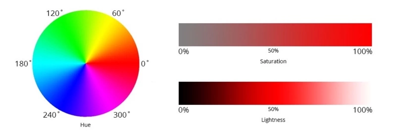

# Selecting and styling 

# HSL Color
HSL Color เป็นระบบสีที่มนุษย์ เข้าใจได้ง่าย เพราะไม่ได้นิยามสีจากการผสมสี แต่เป็นระบบที่สร้างสีขึ้นมาจาก Hue (เนื้อสี), Saturation (ความอิ่ม) และ Lightness (ความสว่าง)

## Saturation
Saturation คือความอิ่มของสี มีหน่วยเป็นเปอร์เซ็นต์ ตั้งแต่ 0% ถึง 100% การเพิ่มลดค่า Saturation ก็เปรียบเสมือนการเพิ่มลดเนื้อสี ว่าใส่สีลงไปมากน้อยแค่ไหน โดยที่ 0% จะเหมือนว่าเราไม่ได้เจือสีลงไป ก็จะได้ผลลัพธ์เป็นสี Grayscale จืด ๆ นั่นเอง

## Lightness
Lightness คือความสว่างของสี มีหน่วยเป็นเปอร์เซ็นต์ ตั้งแต่ 0% ถึง 100% การเพิ่มลด Lightness จะเหมือนการที่เราเอาสีขาว หรือสีดำ ผสมลงไปที่ Hue

ที่ 50% คือค่าตั้งต้น จะมีสีเป็นสีเทา โดยที่ค่าที่มากกว่า 50% จะมีความขาวมากขึ้น หรือที่เรียกว่า tints และค่าที่ต่ำกว่า 50% จะมีความดำมากขึ้น หรือที่เรียกว่า shades นั่นเอง

# Box model

## 
