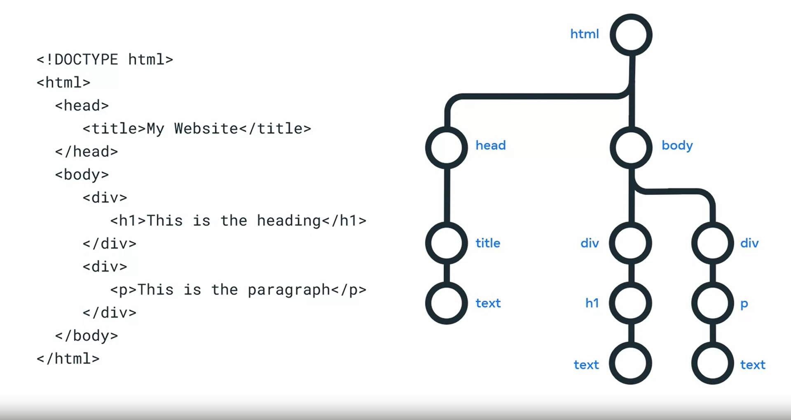
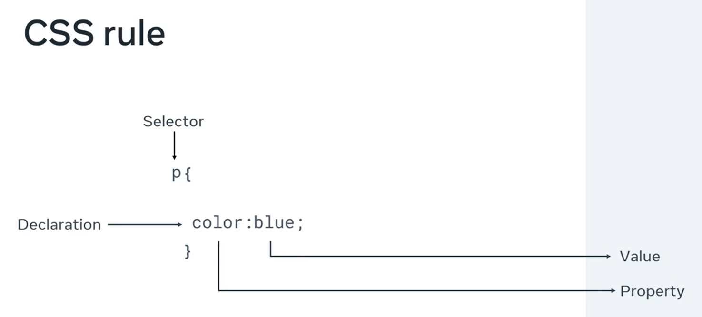
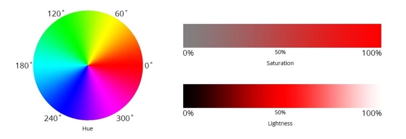
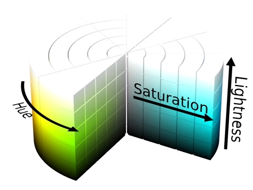

## DOM
- Stands for Document Object Model
- Tree structure of the objects.

# Selecting and styling 

# HSL Color
HSL Color เป็นระบบสีที่มนุษย์ เข้าใจได้ง่าย เพราะไม่ได้นิยามสีจากการผสมสี แต่เป็นระบบที่สร้างสีขึ้นมาจาก Hue (เนื้อสี), Saturation (ความอิ่ม) และ Lightness (ความสว่าง)

## Saturation
Saturation คือความอิ่มของสี มีหน่วยเป็นเปอร์เซ็นต์ ตั้งแต่ 0% ถึง 100% การเพิ่มลดค่า Saturation ก็เปรียบเสมือนการเพิ่มลดเนื้อสี ว่าใส่สีลงไปมากน้อยแค่ไหน โดยที่ 0% จะเหมือนว่าเราไม่ได้เจือสีลงไป ก็จะได้ผลลัพธ์เป็นสี Grayscale จืด ๆ นั่นเอง

## Lightness
Lightness คือความสว่างของสี มีหน่วยเป็นเปอร์เซ็นต์ ตั้งแต่ 0% ถึง 100% การเพิ่มลด Lightness จะเหมือนการที่เราเอาสีขาว หรือสีดำ ผสมลงไปที่ Hue

ที่ 50% คือค่าตั้งต้น จะมีสีเป็นสีเทา โดยที่ค่าที่มากกว่า 50% จะมีความขาวมากขึ้น หรือที่เรียกว่า tints และค่าที่ต่ำกว่า 50% จะมีความดำมากขึ้น หรือที่เรียกว่า shades นั่นเอง

## Q & A

### Q: True or false. The Document Object Model allows you to update all HTML elements on a web page.
- A: True. The DOM allows you to update and delete existing elements on the web page.

### Q: Which of the following technologies are examples of assistive technologies? Select all that apply.
- A: Screen reader software, Subtitles in videos and Speech recognition software.

### Q: As a developer, there are several web browser developer tools available to you. For example, there is a console tab that outputs JavaScript logs and errors from a web application. Which of the following statements are true? Choose all that apply.
- A: The Network tab allows you to inspect the timeline and details of HTTP requests and responses for a webpage, The Sources tab shows all content resolved for the current page and  The Memory tab displays the parts of your code that are consuming the most resources.

### Q: An integrated development environment, or IDE, is software for building applications. This kind of software application has many different features to help you as a developer. Which of the following statements are true? Choose all that apply.
- A: Special keywords of the programming language are highlighted in different colors to make the code easier to read, IDEs have a feature called Error Highlighting and IDEs have a feature that can detect variables and functions and offer them as suggestions during autocomplete.

### Q: There is no difference between web apps and cross-platform apps. 
- A: False

### Q: When you create a CSS rule, the part inside the curly brackets is called the:
- A: Declaration block

### Q: You are busy designing a web page for a small company. They supplied you with an image that needs to be in the center on the landing page. The image has a content width of 100px, 10px padding on both left and right sides, a 10px border on both left and right sides and a 10px margin on both left and right sides. What is the border box width?
- A: 140

### Q: True or false. Inline elements appear on a new line. 
- A: False